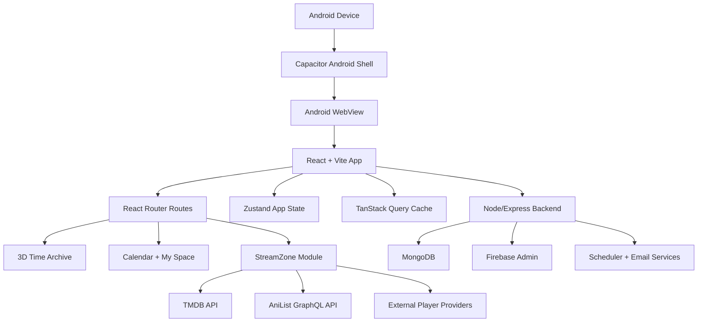

# Categloge / Movie Catalogue

Categloge is a cinematic movie, TV, anime, calendar, and personal watch-planning app built for both web and Android. It uses React, Vite, Capacitor, Android WebView, Node.js, MongoDB, Firebase, TMDB, AniList, and external playback providers.

The project started as a 3D time-travel movie catalogue, then grew into a full entertainment app with a web experience and a Capacitor Android shell. The current build includes StreamZone, an in-app streaming area where users can browse movies, TV series, and anime, open detail pages, continue watching, filter by genre, search, and play content in a mobile-focused landscape player.

## Live Web App

Primary website:

```text
https://utkarsh.sbs
```

Vercel deployment:

```text
https://movie-catalogue-taupe.vercel.app/
```

## Latest Android Debug APK

The latest Android test build is published from GitHub Releases:

```text
https://github.com/Rana3112/Movie-Catalogue/releases/latest
```

Download the debug APK asset from the release page and install it on an Android phone for testing.

Asset name used for the StreamZone test release:

```text
Categloge-StreamZone-debug.apk
```

Latest APK checksum:

```text
SHA256: D9B3D6D250CE335705C46BF344DC3D454C45F8F69DBBADBB142D6A3C6753CF19
```

This is a debug build for testing, not a Play Store production build. Android may show an "unknown app" warning during installation because the APK is not installed from Google Play.

## Latest Web And Android Updates

### Android Version

- Added the Netflix-style dark red neumorphic visual system across the Android app shell.
- Updated Time Archive, category, genre, calendar, My Calendar, My Space, login/signup, and add-entry surfaces to use the darker cinematic theme.
- Added StreamZone with movie, TV series, anime, genre, search, detail, See All, and fullscreen player flows.
- Hardened movie and TV playback against popup windows and app-level ad redirects.
- Fixed Android physical back button behavior so it navigates through React app history instead of minimizing the app during normal flows.
- Improved fullscreen landscape player fit with immersive Android system UI handling.
- Improved My Space scrolling performance on Android by using a virtualized grid, lighter native card shadows, fewer blur layers, and a stable render window.
- Improved My Calendar scrolling performance on Android by reducing heavy card effects, lazy-decoding poster images, and cancelling long-press work when the user scrolls.
- Updated the Android debug APK release with the latest performance build.

### Web Version

- Reworked the web app separately from the Android layout so the same repository can support both without forcing phone-sized spacing on desktop.
- Added a premium animated landing page with cinematic dark UI, poster cards, StreamZone highlights, calendar/watchlist previews, and tech architecture sections.
- Added official-style poster imagery to the landing page and fixed poster aspect-ratio handling.
- Propagated the Netflix-style dark red neumorphic theme through the web Time Archive, category, genre, calendar, My Calendar, My Space, login/signup, and add-entry pages.
- Improved calendar cells on web so they use portrait poster-like cards instead of wide rectangular cells.
- Added hover previews on My Calendar for days with multiple entries, showing saved title details, genre/status/rating context, and short descriptions where available.
- Added scroll support to the My Space filter sidebar so category, status, and genre filters remain usable on smaller desktop heights.
- Improved local and production auth error messages for Firebase Google sign-in domain/API-key configuration.

## What Was Added In The Latest Android Build

### StreamZone

StreamZone is the new streaming section inside the Android app. It is opened from the Time Archive screen through the "Enter StreamZone" action.

Current StreamZone features:

- Movies, TV Series, and Anime category tabs.
- Hero carousel with featured content and a Watch Now action.
- Continue Watching row.
- Trending, Top Rated, Popular, Seasonal, and category-specific content rows.
- Detail pages for movies, TV series, and anime.
- Episode lists for TV series and anime.
- Search page for finding movies, shows, and anime.
- Watchlist button support on content cards and detail views.
- "See All" pages for browsing a full collection instead of only the horizontal preview row.
- Dedicated Genres page with searchable genre filters.
- Mobile-first dark streaming UI styled for Android screens.

### Movie And TV Playback

Movie and TV playback now uses the configured VidZee player:

```text
VITE_VIDZEE_PLAYER=https://player.vidzee.wtf
```

The app opens movie and TV content inside the StreamZone player screen. The Android WebView has been hardened so popup windows and unwanted top-level redirects are blocked while playback is open.

Important behavior:

- Movie and TV playback opens in a landscape player.
- Tapping inside the provider player no longer redirects the whole Android app to an advertisement site.
- Popups and multiple WebView windows are disabled from the native Android layer.
- The player screen keeps the close control above the video surface.
- External provider UI inside the iframe is still controlled by the provider, but app-level navigation away from Categloge is blocked.

### Anime Playback

Anime playback was changed away from the unavailable HiAnime/AniWatch backend deployment path. The app now uses a configurable anime player base URL:

```text
VITE_ANIME_PLAYER=https://vidnest.fun
```

The frontend builds anime episode player URLs through:

```text
src/streaming/api/streams.js
```

The current anime embed shape is:

```text
{VITE_ANIME_PLAYER}/animepahe/{anilistId}/{episode}/{sub|dub}?servericon=true&pip=true
```

This means anime metadata still comes from AniList, while playback is handled by the configured anime player provider. If that provider changes its routes or removes an episode, only the provider adapter needs to be updated.

### Android Back Button Fix

The Android physical back button now behaves like an app navigation back button.

Before the fix:

- Pressing the Android back button could minimize the whole app.

After the fix:

- Pressing the Android back button dispatches a native event into React.
- React Router moves back to the previous app page.
- Root pages stay stable instead of unexpectedly closing the app.

Implementation files:

```text
android/app/src/main/java/com/moviecatalogue/app/MainActivity.java
src/App.jsx
```

### Fullscreen Landscape Player Fit

The StreamZone player was adjusted for mobile playback.

Current behavior:

- The player screen uses the full Android viewport.
- The shell uses a black background for playback.
- Scrolling is disabled while the player is active.
- Native Android immersive sticky mode hides system UI during playback.
- Orientation and system UI are restored when leaving the player.
- The close button stays available without shrinking the playback area.

### Ad Redirect Protection

Movie and TV providers can display content inside their player UI, but the app now blocks the main Android app from being navigated away by provider ad clicks.

Native WebView protections:

- `setSupportMultipleWindows(false)`
- `setJavaScriptCanOpenWindowsAutomatically(false)`
- `onCreateWindow(...)` returns `false`
- Top-level navigation away from the local app is blocked while `/streaming/player` is active.

This protects the app shell. It does not fully remove provider-controlled ads inside an embedded third-party player.

### See All Pages

Horizontal StreamZone rows now have working full-list pages.

Route:

```text
/streaming/list/:category/:collection
```

Supported examples:

- Movie trending
- Movie top rated
- Movie popular
- TV trending
- TV popular
- Anime trending
- Anime seasonal
- Anime popular

The "See All" action opens a grid page with more items and pagination-style loading.

### Genres Page

A dedicated genre browser was added.

Route:

```text
/streaming/genres
```

Genre page behavior:

- Category tabs: All, Movies, TV Series, Anime.
- Search box for filtering genre names.
- Selecting a genre loads matching content cards.
- Movie and TV genre results use TMDB genre/discover data.
- Anime genre results use AniList genre filtering.
- Cards route to the correct detail page based on content type.

### Android Configuration Updates

The Capacitor Android app allows the domains needed by the app, API, metadata providers, and player providers.

Main config file:

```text
capacitor.config.json
```

Important Android behavior:

- Capacitor native shell wraps the React app.
- Android WebView allows media playback without requiring a second user gesture.
- Mixed content is enabled because some provider media chains may include mixed resource types.
- WebView debugging is enabled for debug builds.
- Splash screen and status bar are configured for the app theme.

## How Users Operate The Android App

### 1. Install The APK

1. Open the GitHub Releases page.
2. Download `Categloge-StreamZone-debug.apk`.
3. On Android, allow installation from the browser or file manager if prompted.
4. Tap the APK and install it.
5. Open "Movie Catalogue" from the Android launcher.

### 2. Start The App

On first launch, users can:

- Sign up or log in.
- Continue as a guest if guest access is enabled.
- Use the cinematic home experience after entering the app.

### 3. Explore The Time Archive

The home experience presents the Time Archive and year-based discovery flow. Users can scroll through years, select a year, explore categories, and open movie information.

### 4. Open StreamZone

Tap:

```text
Enter StreamZone
```

The app opens the streaming home screen.

### 5. Browse Content

Inside StreamZone:

- Use Movies, TV Series, and Anime tabs to switch content type.
- Swipe or scroll through rows such as Trending, Top Rated, Popular, and This Season.
- Tap a card to open the detail page.
- Tap "See All" to browse the full collection.
- Use the search page to find a title directly.
- Open Genres to browse by genre.

### 6. Play A Movie

1. Open StreamZone.
2. Tap Movies.
3. Select a movie card.
4. Tap Watch Now or the play action.
5. The landscape player opens.
6. Tap the close button to return to the previous screen.
7. Pressing the Android back button also returns to the previous page.

### 7. Play A TV Episode

1. Open StreamZone.
2. Tap TV Series.
3. Open a TV detail page.
4. Select season and episode if available.
5. Tap the play action.
6. The landscape player opens for that episode.

### 8. Play An Anime Episode

1. Open StreamZone.
2. Tap Anime.
3. Open an anime detail page.
4. Select an episode.
5. The app opens the configured anime provider player for that AniList title and episode number.

If an episode shows as missing, the metadata exists but the configured anime provider does not have a playable embed for that exact title or episode route.

### 9. Use Genres

1. Open StreamZone.
2. Tap the Genres button.
3. Choose All, Movies, TV Series, or Anime.
4. Search for a genre such as Action, Comedy, Drama, Sci-Fi, Romance, or Shounen.
5. Tap a genre.
6. Browse the result cards.
7. Tap any card to open details.

### 10. Use Android Back Navigation

The Android back button now moves through the app history:

- Player page -> previous detail page.
- Detail page -> previous list/home page.
- Search/Genres/List page -> StreamZone/home route.
- Root app screens do not unexpectedly minimize from normal navigation.

## Application Architecture



### Frontend Layer

The frontend is a React application built with Vite.

Important files:

```text
src/App.jsx
src/pages/*
src/components/*
src/store/useStore.js
src/streaming/*
```

Responsibilities:

- App routing.
- Authentication-aware protected pages.
- Guest and logged-in app flows.
- 3D discovery screens.
- Calendar and My Space user workflows.
- StreamZone UI and playback navigation.
- Client-side state and caching.

### Routing Layer

Routing is handled by React Router.

Web builds use:

```text
BrowserRouter
```

Native Android builds use:

```text
HashRouter
```

This keeps Android WebView navigation stable inside Capacitor.

Main app routes:

```text
/                 Landing
/login            Login
/signup           Signup
/home             Time Archive home
/category         Category selection
/genres           Original catalogue genre flow
/calendar         Calendar planner
/myspace          User dashboard
```

StreamZone routes:

```text
/streaming
/streaming/movie/:id
/streaming/tv/:id
/streaming/anime/:id
/streaming/player
/streaming/search
/streaming/list/:category/:collection
/streaming/genres
```

### StreamZone Module

StreamZone is isolated under:

```text
src/streaming
```

Structure:

```text
src/streaming/api
src/streaming/components
src/streaming/hooks
src/streaming/pages
src/streaming/store
```

Key responsibilities:

- `api/tmdb.js`: movie and TV metadata.
- `api/anilist.js`: anime metadata and genre discovery.
- `api/streams.js`: player URL generation and playback configuration.
- `pages/StreamingHome.jsx`: StreamZone landing screen.
- `pages/MovieDetail.jsx`: movie details and watch action.
- `pages/TVDetail.jsx`: TV details and episode playback.
- `pages/AnimeDetail.jsx`: anime details and episode playback.
- `pages/PlayerPage.jsx`: fullscreen playback shell.
- `pages/SearchPage.jsx`: streaming search.
- `pages/StreamingListPage.jsx`: See All grid pages.
- `pages/GenresPage.jsx`: genre browser and filtered results.

### Playback Architecture

Playback is passed through route state into:

```text
/streaming/player
```

Reusable playback shape:

```js
{
  mode: "iframe",
  src: "https://provider.example/embed/...",
  title: "Title",
  category: "movie | tv | anime",
  posterUrl: "https://image..."
}
```

Current behavior:

- Movies use VidZee iframe embeds.
- TV episodes use VidZee iframe embeds.
- Anime episodes use the configured anime iframe provider.
- The player page controls layout, close behavior, native player mode, and mobile viewport fitting.

### Native Android Layer

Native Android code lives in:

```text
android/app/src/main/java/com/moviecatalogue/app/MainActivity.java
```

Responsibilities:

- Configure WebView media playback.
- Allow JavaScript and DOM storage for the app shell.
- Disable popup windows from provider players.
- Block unwanted top-level navigation from the player page.
- Dispatch Android physical back button events into React.
- Enable immersive sticky mode while the StreamZone player is active.
- Restore system UI after closing playback.

### Backend Layer

The backend is a Node.js and Express API under:

```text
server
```

Responsibilities:

- User signup/login routes.
- JWT auth support.
- Firebase Admin token verification support.
- MongoDB persistence for users and calendar entries.
- Scheduler/email support.
- Streaming-related backend routes for resolver/proxy experiments and future provider expansion.

Main backend files:

```text
server/index.js
server/scheduler.js
server/routes/streaming.js
server/models/*
```

### Data Providers

The app uses multiple data/provider layers:

- TMDB for movie and TV metadata, posters, ratings, genres, and discovery.
- AniList for anime metadata, episode counts, genres, and discovery.
- VidZee for movie and TV iframe playback.
- VidNest-compatible anime embed route for anime playback.
- MongoDB for app user data and saved catalogue/calendar data.
- Firebase Admin for server-side auth verification where configured.

## Environment Variables

Root frontend `.env` example:

```text
VITE_GOOGLE_CLIENT_ID=your_google_client_id_here
VITE_API_URL=http://localhost:5000
VITE_TMDB_API_KEY=your_tmdb_api_key_here
VITE_TMDB_BASE_URL=https://api.themoviedb.org/3
VITE_TMDB_IMAGE_BASE=https://image.tmdb.org/t/p
VITE_VIDZEE_PLAYER=https://player.vidzee.wtf
VITE_ANIME_PLAYER=https://vidnest.fun
```

Server `.env` example:

```text
MONGODB_URI=
PORT=5000
JWT_SECRET=
HIANIME_API_BASE_URL=https://your-aniwatch-api-instance
STREAM_PROXY_SECRET=
OPENROUTER_API_KEY=
SERPAPI_KEY=
FIREBASE_PROJECT_ID=
FIREBASE_CLIENT_EMAIL=
FIREBASE_PRIVATE_KEY=
```

Secrets must stay in local `.env` files or Render environment variables. Do not commit real API keys, database URLs, JWT secrets, or Firebase private keys.

## Local Development

Install frontend dependencies:

```bash
npm install
```

Install backend dependencies:

```bash
cd server
npm install
```

Run the backend:

```bash
cd server
npm start
```

Run the frontend:

```bash
npm run dev
```

Build the web app:

```bash
npm run build
```

## Android Development

Sync the Vite build into Capacitor Android:

```bash
npm run build
npx cap sync android
```

Open Android Studio:

```bash
npm run android:open
```

Build a debug APK from the Android project:

```bash
cd android
./gradlew assembleDebug
```

On Windows PowerShell, if Android Studio's bundled JDK is required:

```powershell
$env:JAVA_HOME='C:\Program Files\Android\Android Studio\jbr'
$env:PATH="$env:JAVA_HOME\bin;$env:PATH"
cd android
.\gradlew.bat assembleDebug
```

Debug APK output:

```text
android/app/build/outputs/apk/debug/app-debug.apk
```

Install to a connected Android device with USB debugging:

```powershell
adb install -r android/app/build/outputs/apk/debug/app-debug.apk
```

## Deployment

Frontend:

- Vercel or any static hosting that can serve the Vite build.

Backend:

- Render web service running `npm start` in the `server` app.
- Required backend secrets should be configured in the Render dashboard.

Android:

- Debug APKs are published through GitHub Releases for tester installation.
- Production builds should use a signed release APK/AAB, not the debug APK.

## Known Provider Notes

Streaming provider availability can change without code changes in Categloge. If a provider changes an embed route, removes a title, or blocks a WebView, the relevant player adapter must be updated.

Provider-specific UI inside an iframe is controlled by that provider. Categloge blocks app-level redirects and popups, but cannot fully control every element inside a third-party player iframe.

## Repository

```text
https://github.com/Rana3112/Movie-Catalogue
```

## Live Web App

```text
https://utkarsh.sbs
```

Vercel fallback:

```text
https://movie-catalogue-taupe.vercel.app/
```
